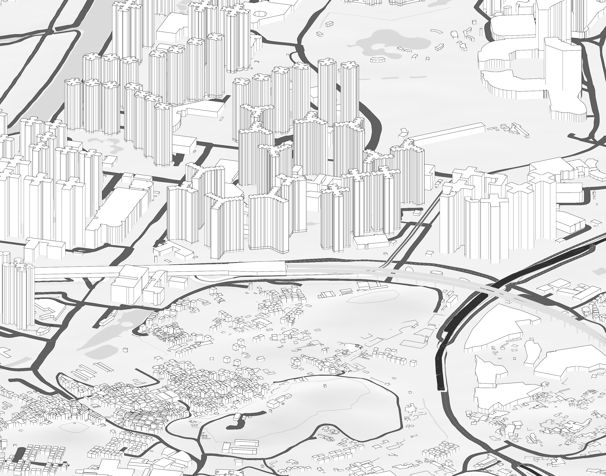
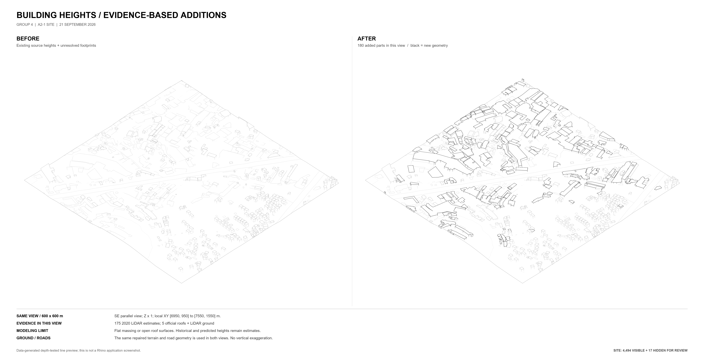
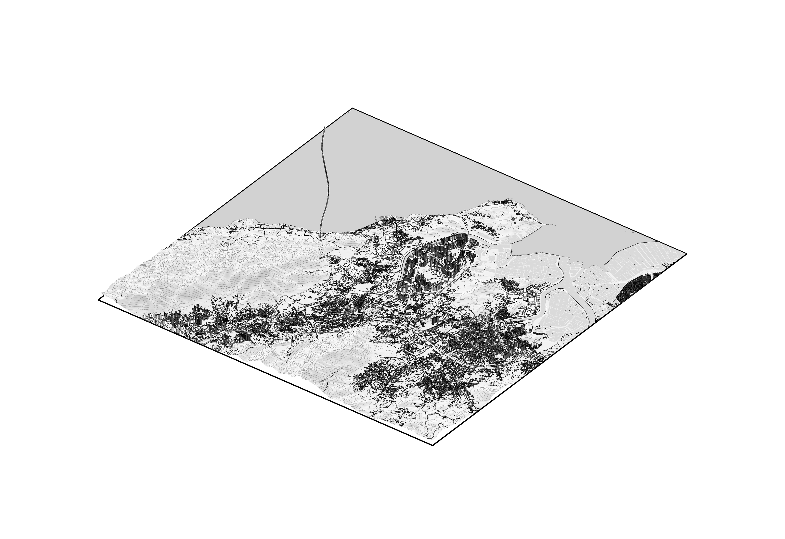

# Hong Kong Urban Site Study

**Ewan · GIS → urban morphology → Rhino site modelling**  
Work in progress · Public snapshot: 24 September 2026

[中文说明](README.zh-CN.md) · [Urban tissue](docs/urban-tissue.md) · [Building heights](docs/building-heights.md) · [Terrain & transport](docs/terrain-and-transport.md) · [Validation](docs/validation.md)

An AI-assisted study of a **10 × 10 km** site in north-west Hong Kong, bringing historical map interpretation, building massing, terrain and transport infrastructure into a common spatial frame. The project asks how an urban model can become more informative while keeping the distinction between source evidence, interpretation and geometric estimates visible.

*Latest stage: rail and road grade separation at Tin Shui Wai. Native Rhino capture; elevated profiles and supports are model estimates.*

## Project at a glance

| Scope | Current public snapshot |
|---|---|
| Spatial frame | 100 km²; EPSG:2326 source coordinates; full-size metres; no vertical exaggeration |
| Urban tissue study | Four paired 800 × 800 m windows, comparing c.1999–2000 maps with a 2026 compilation |
| Height enrichment | 4,511 building/structure parts given additional height representation at the 21 September stage; confidence and unresolved cases recorded |
| Latest model | 76,302 model-space objects, 58 layers and 55 material-table records |
| Recorded checks | 21 rail-module crossing checks, 45 rail/ground-road checks and 86 closed-deck checks |
| Public contents | Selected images, methods, source credits and a summary of local validation records |

Counts describe their stated stage and test scope. A source part is not necessarily a separate building. Geometric checks do not establish survey accuracy or engineering safety.

## Follow the work

1. **[Read urban change from evidence](docs/urban-tissue.md).** Compare formation, persistence and internal reorganisation without treating missing historical coverage as empty land.
2. **[Add heights with provenance](docs/building-heights.md).** Combine official attributes with historic LiDAR estimates; retain unsupported footprints without assigning arbitrary heights.
3. **[Resolve terrain and transport relationships](docs/terrain-and-transport.md).** Integrate coastline, terrain, roads, bridge approaches and railway crossings, while identifying unresolved vertical relationships.
4. **[Check the saved result](docs/validation.md).** Review object preservation, crossing checks, native reopening and the limitations of the public evidence.

*Earlier height-enrichment stage. This is a data-generated comparison using the same camera and ground geometry, not a Rhino application screenshot. The example window contains 180 added parts.*

## Overall site

*Latest native Rhino capture. The rectangular boundary is 10 × 10 km; the camera includes margins around the site.*

[Open the plan view](images/site-global-plan.png) · [Browse the image index](images/README.md)

## Workflow and contribution

This portfolio snapshot develops **Group 4 coursework material** supplied within Ewan's ongoing project. Ewan provides the project brief, source materials and requested revisions. Codex assists with data processing, scripts, model integration, checks and documentation. Shared coursework, official mapping and third-party datasets remain credited in [Sources & credits](SOURCES.md); this page does not claim sole authorship of those inputs or unaided manual modelling.

The local workflow connects GIS evidence review, scripted geometry processing and native Rhino output. Separate source, estimate and review layers support iterative correction. The latest saved model was reopened in Rhino 8 and compared with its integration master; the public summary links the reported checks to file hashes.

## Reading the evidence

**This repository is a visual case study, not a downloadable model or a reproducible source-data release.** Models, CAD/GIS geometry, raw datasets and original working logs remain local. Public summaries omit local paths and personal identifiers; Ewan is the personal byline.

The transport model uses official plan geometry with estimated vertical profiles, deck thicknesses and supports. The C06 boundary bridge and Tin Shui Wai station context retain unresolved height relationships. See the [specific limitations](docs/terrain-and-transport.md#known-limitations) before interpreting the images.

- [Validation narrative](docs/validation.md)
- [Machine-readable summary](evidence/summary.json)
- [Image provenance and hashes](evidence/image-manifest.json)
- [Sources, attribution and reuse](SOURCES.md)
