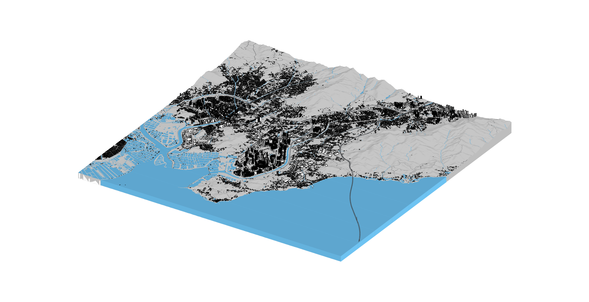
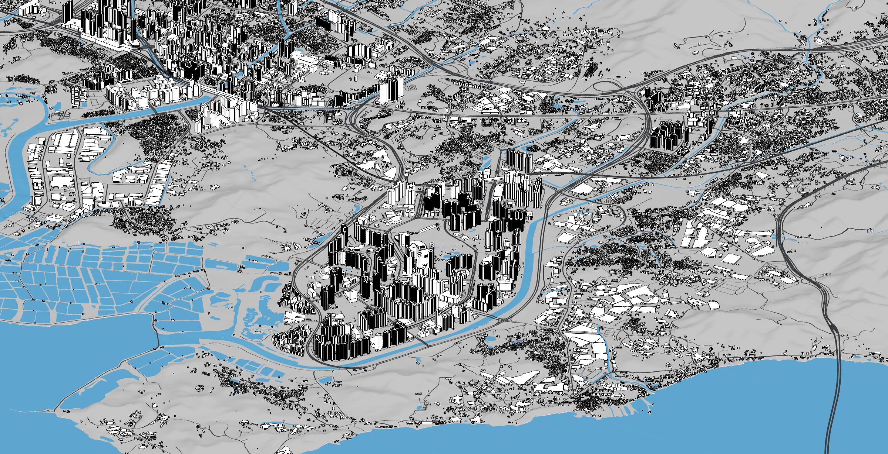
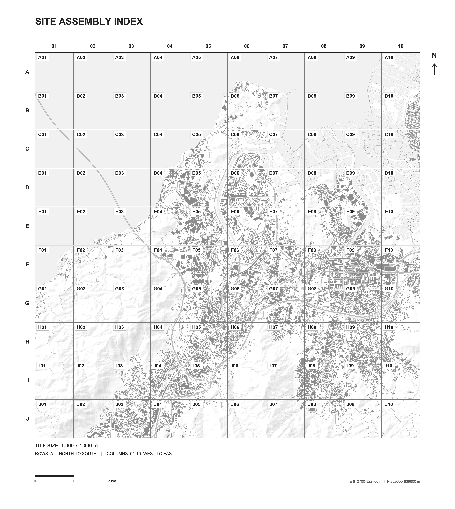
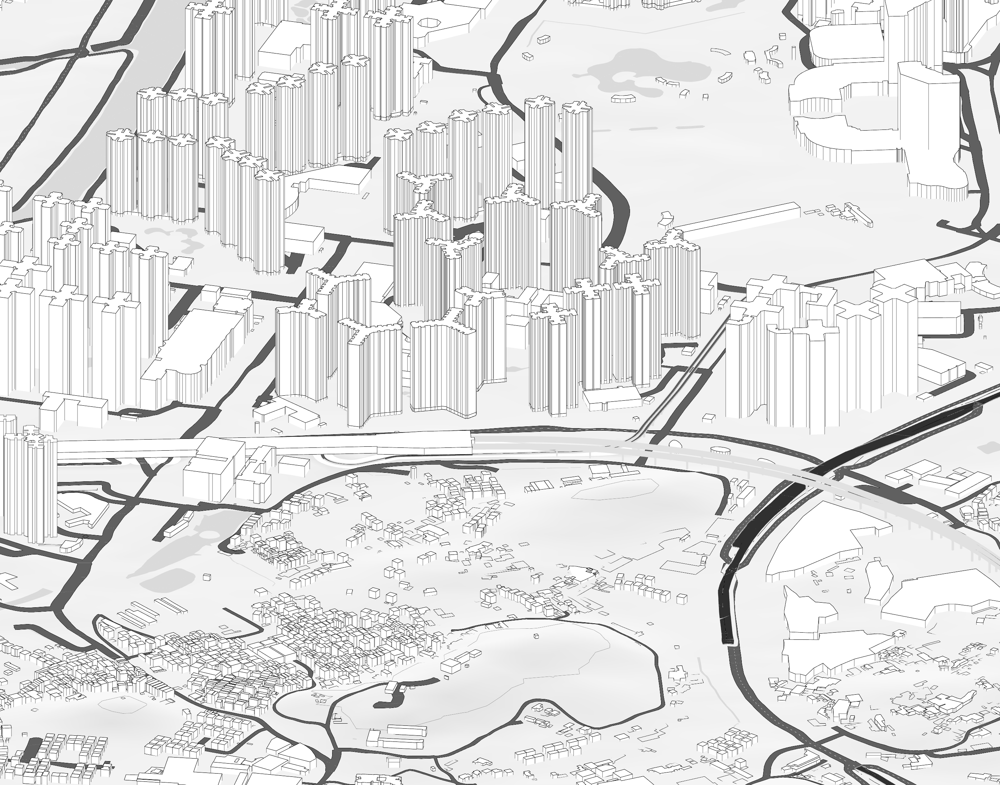
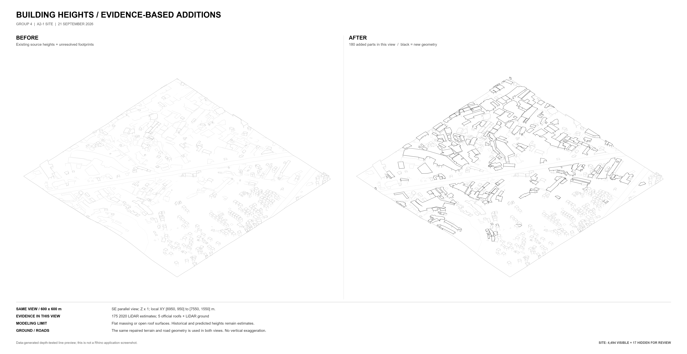

# Hong Kong Urban Site Study

**Ewan · GIS → urban morphology → Rhino site modelling**  
Work in progress · Public snapshot: 9 October 2026

[中文说明](README.zh-CN.md) · [Model & preview](docs/model-and-preview.md) · [Performance](docs/model-performance.md) · [Urban tissue](docs/urban-tissue.md) · [Building heights](docs/building-heights.md) · [Terrain & transport](docs/terrain-and-transport.md) · [Validation](docs/validation.md)

An AI-assisted study of a **10 × 10 km** site in north-west Hong Kong, connecting historical map interpretation, building massing, terrain and transport infrastructure in a common spatial frame. The project keeps source evidence, interpretation and geometric estimates distinguishable.

The latest local deliverables comprise a **67,196-object master model and 100 tiles of 1 × 1 km**. The final gray model combines black building attributes, gray terrain, white foundations and blue water previews. Its master and all 100 tiles were rehashed for this public update and match the final validation record.

*9 October 2026: the final `Overall_Site_Model.3dm` opened in the local Rhino 8.6 application. The overall bird's-eye angle was selected manually in the existing Line drawing style viewport and exported directly with native ViewCaptureToFile at 2400 × 1230. No post-processing or AI redraw; no changes were saved to the source model.*

## Project at a glance

| Scope | Public snapshot |
|---|---|
| Spatial frame | 100 km²; EPSG:2326 source coordinates; full-size metres; no vertical exaggeration |
| Final local models | One master with 67,196 objects and 100 one-kilometre tiles; 101 model files in the final deliverable set |
| Assembly | A–J rows north to south; 01–10 columns west to east; original world coordinates retained |
| Preview | Project Line Drawing and Blue Water Preview modes; gray terrain and black building attributes |
| Urban tissue study | Four paired 800 × 800 m windows, comparing c.1999–2000 maps with a 2026 compilation |
| Height enrichment | 4,511 building/structure parts received additional height representation at the 21 September stage |
| Earlier transport checks | 21 rail-module crossing checks, 45 rail/ground-road checks and 86 closed-deck checks at the earlier integration stage |
| Public contents | Selected images, methods, source credits and summaries of local validation records |

Counts describe their stated stage and scope. The tiles contain 67,177 objects in total; 19 objects outside their indexing extent remain in the master. A source part is not necessarily a separate building. The earlier transport checks were not rerun for this update, and geometric checks do not establish survey accuracy or engineering safety.

## Follow the work

1. **[Read urban change from evidence](docs/urban-tissue.md).** Compare formation, persistence and internal reorganisation without treating missing historical coverage as empty land.
2. **[Add heights with provenance](docs/building-heights.md).** Combine official attributes with historic LiDAR estimates; retain unsupported footprints without assigning arbitrary heights.
3. **[Resolve terrain and transport relationships](docs/terrain-and-transport.md).** Integrate coastline, terrain, roads, bridge approaches and railway crossings, while identifying unresolved vertical relationships.
4. **[Inspect the model and tiles](docs/model-and-preview.md).** Read the assembly convention, project preview settings and geometry-preservation evidence.
5. **[Read the measured tradeoffs](docs/model-performance.md).** Compare the final gray model with preceding versions under a controlled native Rhino benchmark.
6. **[Check the evidence](docs/validation.md).** Separate final-stage checks from earlier records and the current file-identity review.

*Urban and river detail selected manually in the same local Rhino 8.6 Line drawing style viewport on 9 October 2026. Native ViewCaptureToFile export at 2400 × 1230, with no post-processing or AI redraw; the source model was not saved with changes.*

*Native Rhino capture of tile D05 using the calibrated project Line Drawing mode. Its 1,274 buildings have black object attributes; lighting and the display mode can shade individual faces gray. This tile view is a functional preview check, not a performance sample.*

*Generated assembly diagram for the 100 one-kilometre tiles; this index is not a Rhino screenshot.*

[8 October controlled Shaded benchmark capture](images/model-gray-axon.png): a separate native capture from the isolated performance-test configuration, documented in [Performance](docs/model-performance.md). It does not represent the computer's default Shaded configuration or the new presentation views above.

## Earlier study stages

*Earlier transport integration stage. Native Rhino capture; elevated profiles and supports are model estimates.*

*Earlier height-enrichment stage. Data-generated comparison using the same camera and ground geometry, not a Rhino application screenshot. The example window contains 180 added parts.*

[Earlier overall axonometric view](images/site-global-axon.png) · [Earlier plan view](images/site-global-plan.png) · [Image index](images/README.md)

## Workflow and contribution

This portfolio snapshot develops **Group 4 coursework material** supplied within Ewan's ongoing project. Ewan provides the project brief, source materials and requested revisions. Codex assists with data processing, scripts, model integration, checks and documentation. Shared coursework, official mapping and third-party datasets remain credited in [Sources & credits](SOURCES.md); this page does not claim sole authorship of those inputs or unaided manual modelling.

The local workflow connects GIS evidence review, scripted geometry processing and native Rhino output. Separate source, estimate and review layers support iterative correction. All 101 final model files were checked with the official openNURBS 7 reader kernel; native reopening and display checks used Rhino 8. Rhino 7 desktop operation was not tested. The 9 October review confirms saved-file identity and does not rerun all geometry or performance checks.

## Reading the evidence

**This repository is a visual case study, not a downloadable model or a reproducible source-data release.** Native models, ZIP packages, CAD/GIS geometry, raw datasets, machine-specific scripts and original working logs remain local. Public summaries omit local paths and personal identifiers; Ewan is the personal byline.

The transport model uses official plan geometry with estimated vertical profiles, deck thicknesses and supports. The C06 boundary bridge and Tin Shui Wai station context retain unresolved height relationships. See the [specific limitations](docs/terrain-and-transport.md#known-limitations) before interpreting the images.

- [Model and preview methods](docs/model-and-preview.md)
- [Performance conditions and results](docs/model-performance.md)
- [Validation narrative](docs/validation.md)
- [Machine-readable summary](evidence/summary.json)
- [Image provenance and hashes](evidence/image-manifest.json)
- [Sources, attribution and reuse](SOURCES.md)
