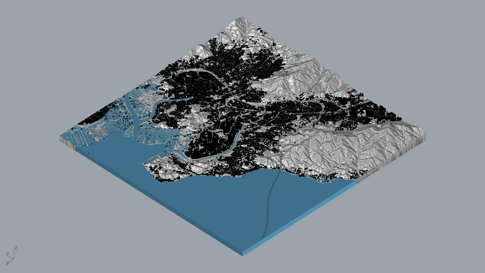

# Final gray model and project previews

[Project overview](../README.md) · [Performance](model-performance.md) · [Validation](validation.md) · [Sources & credits](../SOURCES.md)

The final local deliverable set contains one master and **100 tiles**, covering a **10 × 10 km** site. This page describes assembly, appearance and the checks behind the public images. The model files and preview INI files remain local; this repository provides a visual and methodological record.

## Native presentation captures

On **9 October 2026**, the final `Overall_Site_Model.3dm` was opened in the local **Rhino 8.6** application. The overall bird's-eye and urban-river detail angles were selected manually in its existing **Line drawing style** viewport. Both images were exported directly with native **ViewCaptureToFile** at **2400 × 1230**, without post-processing or AI redraw. No changes were saved to the source model.

*Overall bird's-eye view selected in the local Rhino application on 9 October 2026.*

*Detail view from the same model and display mode. These presentation captures are separate from the 8 October performance benchmark.*

## Model extent and assembly

| Property | Final stage |
|---|---|
| Master | 67,196 model-space objects |
| Tiles | 100 files, each 1,000 × 1,000 m; 67,177 objects in total |
| Master-only objects | 19 objects outside the tile indexing extent |
| Numbering | Rows A–J north to south; columns 01–10 west to east |
| Coordinates and scale | Original world coordinates, full-size metres, 1:1 |
| Absolute model tolerance | 0.001 m |
| File format | Rhino 7 (`archive_version = 70`) |

The tile files retain their positions in the master coordinate system: importing them at their original coordinates assembles the site without manual offsets. For example, `Sliced_Model/D/D05.3dm` identifies row D, column 05. The grid is an indexing and assembly convention, not a claim that every building has been recut at every tile boundary.

*Generated assembly diagram; not a native Rhino capture.*

All 101 models were read using the official openNURBS 7.15 kernel. Supplementary checks used an openNURBS 8 reader for precision and terrain color information. Desktop reopening and native display checks used Rhino 8.6; Rhino 7 desktop operation was not tested. A Rhino 7 file-format check is therefore distinct from a Rhino 7 application test.

## Appearance and display modes

The final color correction changes appearance without changing geometry. It retains the project's water preview and avoids adding Line Drawing overrides to buildings, terrain or foundations.

| Element | Recorded final appearance |
|---|---|
| Buildings | 63,097 objects with black object attributes |
| Terrain | 84 non-foundation meshes with gray object/material RGB 190; vertex grays range from 146 to 198 |
| Foundations | 100 white base meshes, retaining their original open-mesh state |
| Water | 1,069 existing blue-water display overrides retained |

Black building attributes do not guarantee a uniformly black face in every display mode. Lighting, shading and material handling affect what a native viewport shows.

*8 October 2026: native Rhino capture in an isolated, controlled Shaded benchmark configuration. The user's default Shaded configuration was restored after testing. This independent performance-test image is separate from the 9 October presentation captures above.*

The local `Preview_Settings` folder provides `Line_Drawing.ini` and `Blue_Water_Preview.ini`. Import both through Rhino's display-mode settings, then select the project Line Drawing mode. Assigned water objects use the project's Blue Water Preview override. These are project display modes; the final correction did not require altering the computer's default Shaded mode.

The calibrated Line Drawing INI retains its original name, identity and structure. Its five changes enable vertex colors, reduce ambient light and adjust three light-specular values. The Blue Water Preview INI is preserved. The gray terrain material also works in standard Shaded views without a global Shaded customization.

*Native Rhino functional check of tile D05. Its 1,274 building objects have black attributes, while face lighting can produce gray areas. This image is not a timing sample and does not promise every building face will render pure black.*

## Saved display caches

The final models retain native display meshes for **64,166 surface objects**: 75,995 meshes, 3,548,417 faces and 4,491,948 vertices. Native standard-Shaded and calibrated-Line checks reused all 64,166 recorded cache signatures.

Use ordinary **Save** to preserve these caches. **SaveSmall** removes them and changes the first-display conditions. Cache storage increases file size; its measured benefit and cost are documented in [Performance](model-performance.md). The preserved cameras and geometry are separate from application preferences such as wheel-zoom sensitivity. Rhino's Zoom Selected command is useful for navigating to an individual building.

## Geometry optimization and its limits

Before the final color correction, terrain and road processing simplified only certified planar regions: **169 meshes and 68,006 regions**. Total mesh faces fell from 12,520,376 to 10,756,752, a 14.086% reduction; terrain faces fell from 8,831,594 to 7,086,772. Building, railway-detail and river geometry were protected.

The validation examined full projected coverage, holes, orientation and area, with 219,065 original seam segments checked. Its symmetric surface-distance bound was **2.57677 × 10⁻⁷ m**, below the 0.001 m model error limit. This bound measures the simplification's deviation from the source geometry; it does not establish that the source represents the real site to that accuracy. The subsequent color correction adds no geometry error.

## Current verification and public scope

On **9 October 2026**, the master and all 100 tiles were rehashed and matched the final model-validation records. This confirms the identity of the 101 current model files. The file-identity review and new native presentation captures do not rerun the geometry, display-cache validation or performance tests. Earlier rail-crossing and closed-deck counts retain their own historical stage in [Validation](validation.md).

The local final package was verified at delivery. This page does not offer the package for download or imply that the current working directory is an unchanged copy of its original package layout. Machine-specific scripts and their dependencies remain local and are not presented as a portable public pipeline. Shared coursework and source data remain credited in [Sources & credits](../SOURCES.md).
