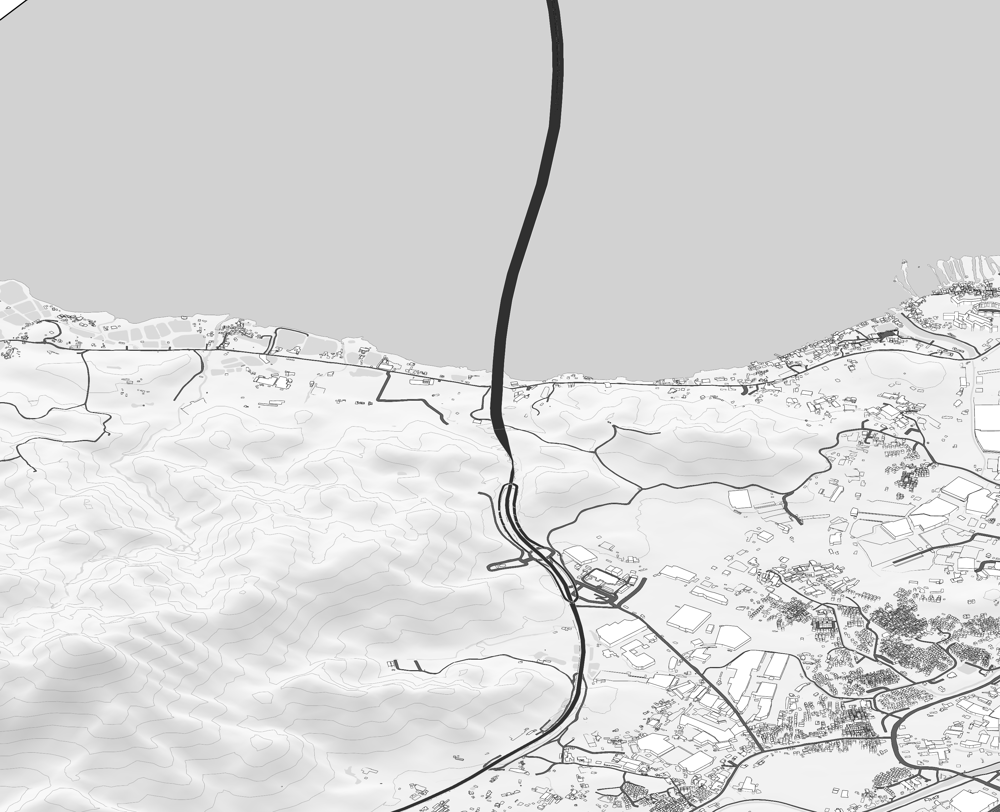
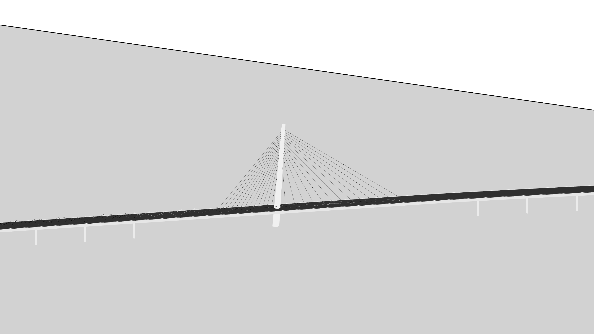
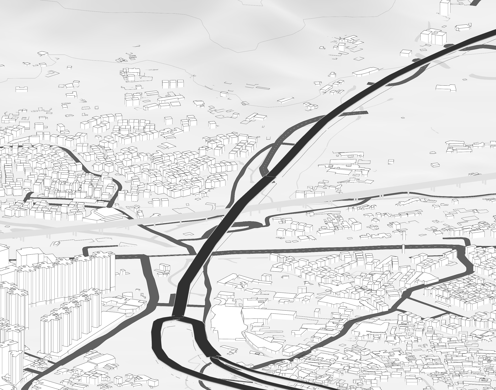
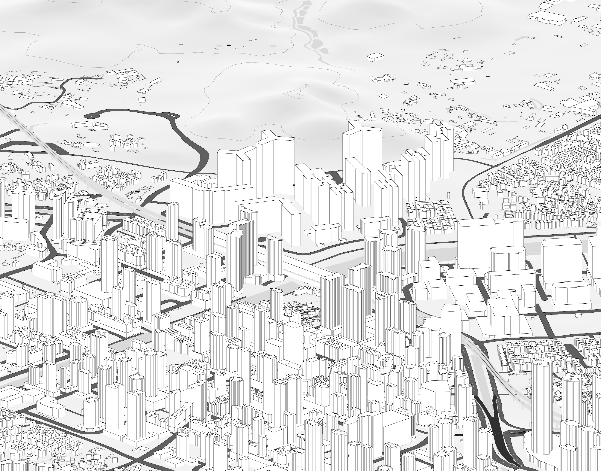
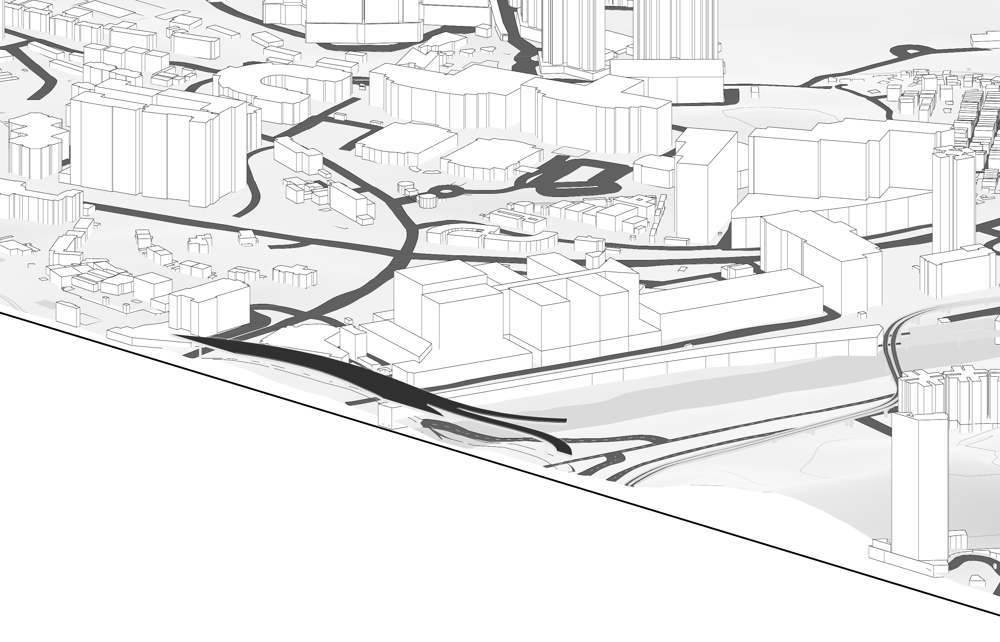

# Terrain, bridges and rail grade separation

[Back to the project](../README.md)

The terrain and transport work brings building massing, continuous road surfaces, coastline, inland water, bridge approaches and rail infrastructure into one 10 × 10 km scene. Source coordinates use EPSG:2326; local model coordinates subtract E=812700 and N=829600. Geometry is in metres at full scale, with a vertical factor of one. The retained print layout uses 1:10,000.

## Terrain and coastal context

*Site-enhancement stage, before the latest rail integration. Native Rhino capture.*

The context includes a 25 m terrain mesh, coastline assembled from official mapping and a gap-filling source, and separate sea and inland-water surfaces. Sea level at Z=0 is a display convention, not a tide observation. Inland water is placed just above contextual terrain; its surface is not a measured water level. Local road cuts and the later Tin Shui Wai ground patch are recorded estimates.

*Pylon, deck, cables and piers clarify the bridge in the study model. Their detailed dimensions are conceptual.*

## Latest railway integration

The latest stage follows 74 official heavy-rail source pieces and represents rail tracks, trackbeds, elevated decks and parapets, together with selected light-rail elevated segments, ground transitions and covered railway context. It adds 445 conceptual rail-support groups comprising 1,335 column and headcap objects.

Twelve vehicle-deck systems are represented, including the C06 boundary bridge. The remaining 11 physical corridors include branched profiles; this is a scoped selection of crossings, not a claim that every real-world bridge has been reconstructed. Ground road surfaces are removed only beneath the portions actually raised, preserving underpasses and unraised parts of the same source route.

*Tin Shui Wai: local ground, station context and elevated connections.*

*Kong Sham Western Highway crossing: modelled separation of transport levels.*

*Long Ping: the elevated railway within dense building massing.*

## What was checked

The frozen rail-module report contains **21 actual-mesh crossing checks** with no reported failures. A separate report records **45 railway-to-ground-road checks** with no reported failures. The integrated model report also includes 86 closed-deck checks.

The crossing method intersects mesh triangles in XY and evaluates the affine vertical separation at overlap-polygon vertices. This checks the delivered geometry under the model's assumptions. It does not verify a surveyed clearance, structural capacity or regulatory compliance. The public counts follow the underlying machine-readable reports; the local narrative's earlier count of 23 is not used.

## Known limitations

- **Plan geometry and elevation have different support.** Official map features support XY positions and identifiers. DATALEVEL is a drawing-order field, not a height in metres. Rail profiles, bridge profiles, deck thicknesses, pier positions and many details remain estimates.
- **C06 / Tsing Tin Road boundary bridge:** the model uses a 20.5 m illustrative deck to avoid a simplified covered structure. A nearby official 15 m spot lacks an unambiguous association with deck or ground. That disagreement remains unresolved. Geometry ends at the study boundary.
- **Tin Shui Wai station context:** the simplified solid station block is not a surveyed interior. Local ground is constrained by nearby official spot heights but remains an estimate; rail/solid-block overlap cannot by itself establish an actual collision.
- **Conceptual spans and supports:** a local avoidance span of roughly 104 m and omitted supports within simplified station context need engineering and survey evidence before further use.
- **Mixed dates and levels of detail:** building heights, terrain, plan mapping and infrastructure references come from different dates and resolutions. The resulting image is an analytical composite.

*C06 boundary segment. This image intentionally accompanies the unresolved height explanation above.*

[Validation record](validation.md) · [Sources & credits](../SOURCES.md)
