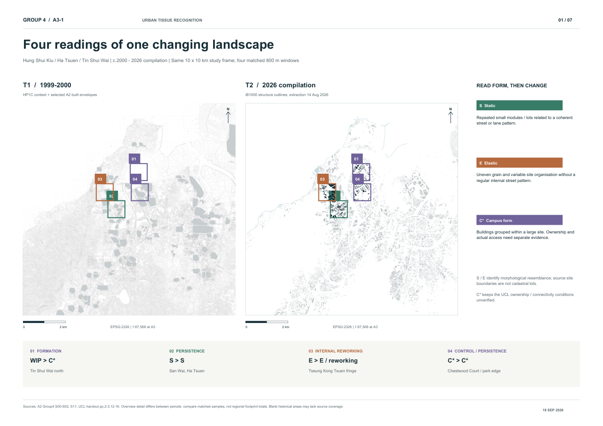

# Urban tissue: formation, persistence and internal change

[Back to the project](../README.md)

The urban tissue study compares four fixed **800 × 800 m** windows within the same 10 × 10 km frame. Historical evidence comes from a c.1999–2000 HP1C mosaic; the comparison material is a 2026 compilation, rather than a single observation made on one date. The local output is a seven-page A3 atlas with paired windows, an evidence matrix and source notes.

*Overview of the Group 4 study. Historical maps, current source vectors and analytical annotations have different evidential roles.*

## Four comparisons

| Window | Reading supported by the supplied evidence | What remains uncertain |
|---|---|---|
| 01 — Tin Shui Wai north | Historical work-in-progress land becomes a clearly organised building group: a Campus-form candidate | Unified ownership and actual public access are unverified |
| 02 — San Wai, Ha Tsuen | Fine, repeated building rows remain recognisable: Static-form persistence with changes around the edges | Persistence of a morphology does not prove unchanged buildings or ownership |
| 03 — Tseung Kong Tsuen warehouse fringe | Earlier open storage and buildings precede the current roof arrangement: internal reorganisation of Elastic form | Current storage cannot all be counted as new development |
| 04 — Chestwood Court / Tin Shui Wai Park edge | Six principal housing forms remain recognisable while an adjacent group appears; the park continues as open-space context | Stable forms do not imply an unchanged neighbourhood; white map areas are not automatically vacant land |

Static and Elastic are interpretive morphology labels, not automatic classifications from a footprint-size threshold. **C\*** means a Campus-form candidate. The fixed analytical boundaries are not confirmed cadastral parcels.

## Measuring only what the data supports

The study records eight period-specific analytical units, 11 selected historical axes and 12 evidence points. Current footprint coverage uses the union of building/structure projections within each fixed analytical unit, counting overlap once.

| Window | T2 unit footprint coverage | Source parts used for the area-median statistic |
|---|---:|---:|
| 01 | 26.99% | 15 |
| 02 | 62.57% | 317 |
| 03 | 27.79% | 56 |
| 04 | 19.39% | 13 |

These percentages describe the selected **units**, not the complete 800 m windows or the whole 100 km² site. The counts refer to source building/structure parts, not independent buildings or households. No equivalent complete historical footprint vector layer was available, so the study does not report a two-period coverage difference or a precise total of buildings gained and lost.

## Historical coverage matters

The HP1C mosaic uses 207 official sheet editions: 163 from 1999 and 44 from 2000. Available period coverage is approximately **81.25 km²**. Another 4.08 km² has indexed sheet locations but no available edition from 2000 or earlier; approximately 14.67 km² falls outside the supplied sheet index. Later sheets were not substituted into those gaps.

Blank historical areas therefore cannot be treated as evidence of empty land. Some secondary coursework layers were retained only for contextual review, and an apparently historical building replacement that was nearly identical to the current source was excluded as independent historical evidence.

The atlas combines vector analysis and annotations with historical raster scans. Source credits and temporal limits are preserved in [Sources & credits](../SOURCES.md).
