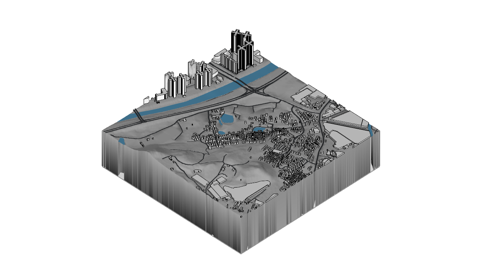

# Image index

[Back to the project](../README.md)

Images are copied from the local project outputs without editing. The public filenames are simplified; no geometry files accompany them. SHA-256 hashes and provenance are recorded in [image-manifest.json](../evidence/image-manifest.json). Captures identify their own stage and display configuration.

## Current model and tiles

| Image | Stage | Provenance |
|---|---|---|
| [Grey-terrain site axonometric](model-gray-axon.png) | Final colour/cache model, 8 October | Native Rhino 8 capture from the third final-model run in the same-period benchmark; controlled, isolated Shaded settings, with vertex colours enabled and mesh wires disabled |
| [D05 tile](tile-d05-line.png) | Final colour/cache model, 8 October | Native Rhino 8 representative 1 × 1 km tile diagnostic using the project's Line drawing style; separate from the whole-site performance samples |
| [Tile assembly index](tile-assembly-index.png) | Retained local project index | Composed plan of 100 tiles, rows A–J north to south and columns 01–10 west to east |

*Grey terrain, blue water and building outlines. Building object colours are black; lit faces in this display mode need not appear uniformly black.*

The two new native capture records identify inputs that match the corresponding current master/tile file hashes. Their image hashes were recomputed for this publication. The global preview uses isolated benchmark settings, rather than claiming to show the workstation's default Shaded mode. The models, settings files and raw diagnostic logs remain local.

[Model and preview](../docs/model-and-preview.md) · [Performance](../docs/model-performance.md)

## Earlier study stages

| Image | Stage | Provenance |
|---|---|---|
| [Urban tissue overview](urban-tissue-overview.png) | A3-1 atlas, 18 September | Composed atlas preview with historical and current map evidence |
| [Building heights before/after](building-heights-before-after.png) | Height enrichment, 21 September | Data-generated comparison plate, not a Rhino screenshot |
| [Coastal bridge approach](coastal-bridge-approach.png) | Site enhancement, 24 September | Native Rhino viewport output, earlier than rail integration |
| [Bridge tower detail](bridge-tower-detail.png) | Site enhancement, 24 September | Native Rhino viewport output; conceptual dimensions |
| [Global axonometric](site-global-axon.png) | Rail integration, 24 September | Native Rhino capture, audit hash checked |
| [Global plan](site-global-plan.png) | Rail integration, 24 September | Native Rhino capture, audit hash checked |
| [Tin Shui Wai interchange](tin-shui-wai-interchange.png) | Rail integration, 24 September | Native Rhino capture, audit hash checked |
| [Kong Sham Western Highway crossing](kong-sham-western-highway-crossing.png) | Rail integration, 24 September | Native Rhino capture, audit hash checked |
| [Long Ping rail context](long-ping-rail.png) | Rail integration, 24 September | Native Rhino capture, audit hash checked |
| [Tsing Tin boundary estimate](tsing-tin-boundary-estimate.png) | Rail integration, 24 September | Native Rhino capture; unresolved height context, audit hash checked |

The 24 September transport images are parallel projections with no vertical exaggeration. Different frames can have different margins and view scales; do not infer physical measurements from displayed browser pixels. Sources and contributors are credited in [SOURCES.md](../SOURCES.md).
